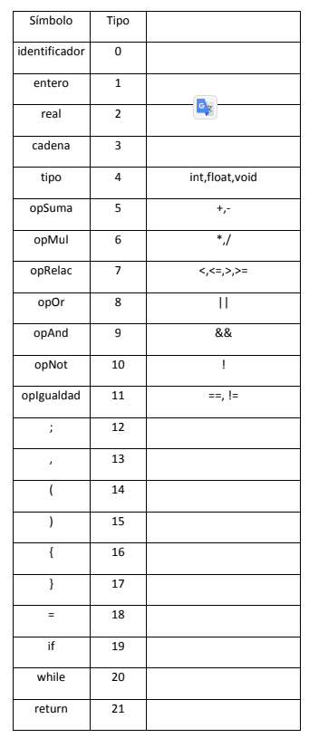
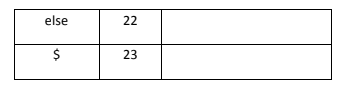
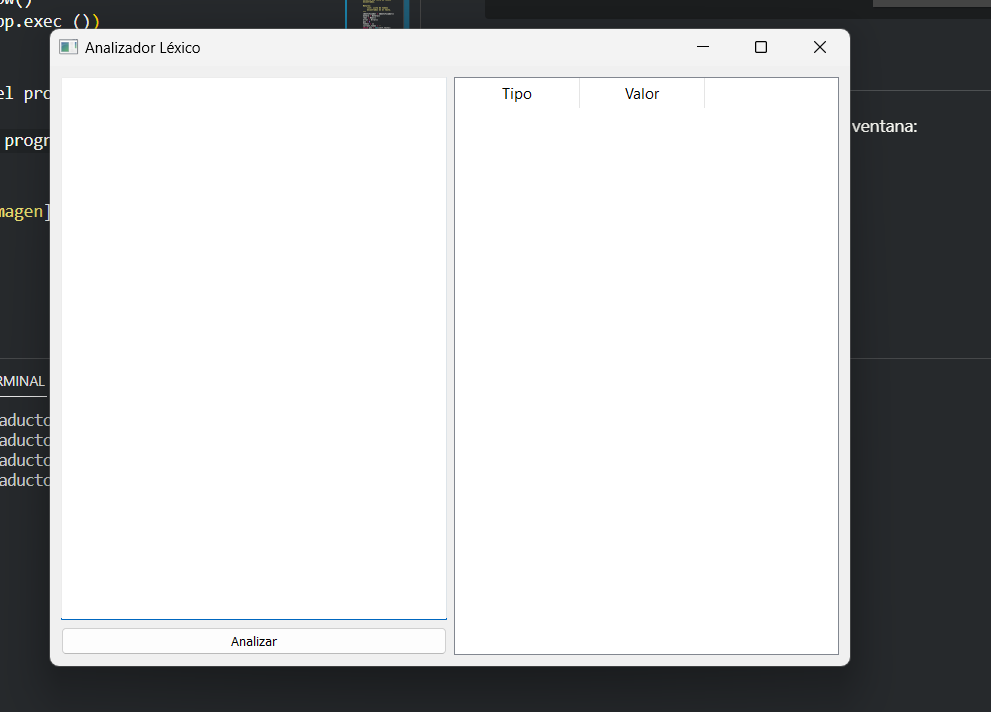
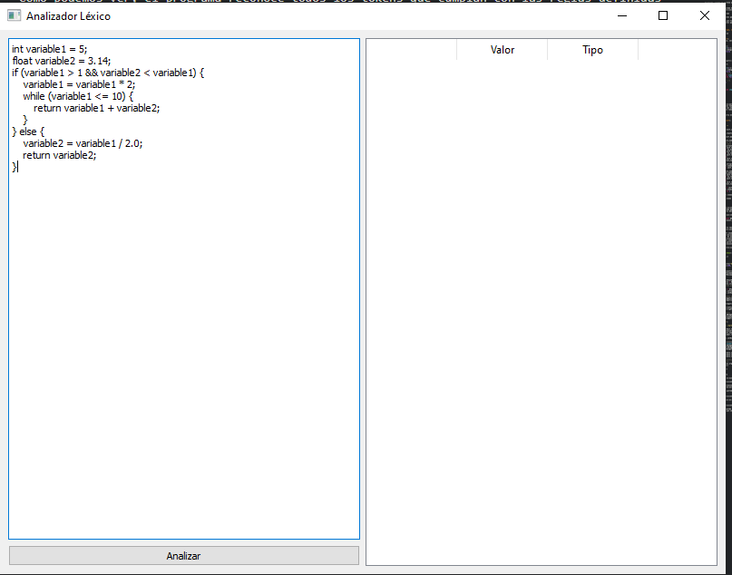
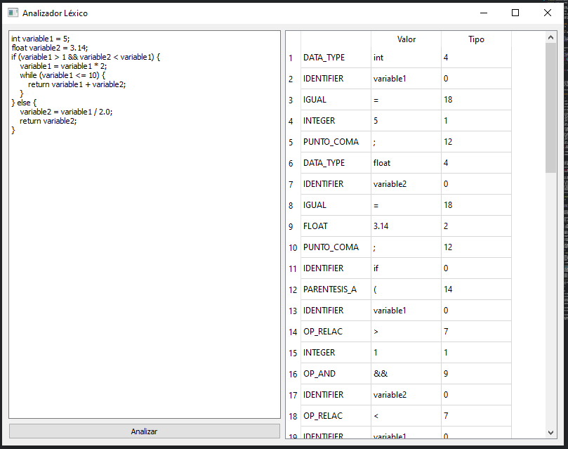

# Analizador léxico completo.

## Introducción
Este programa consiste en un **_analizadr léxico_** que reconoce los siguientes tokens:



Asismismo, cuando se ingresa un caracter no reconocido, el programa lo identifica como un **_error léxico_**.

el objetivo de este programa es mostrar el funcionamiento de un analizador léxico, por lo que no se incluye la parte de sintaxis ni semántica.

## Descripción del programa

### Clase Token y funciones para reconocer los cadenas

Se crea una clase Token que tiene como atributos el tipo de token, su valor y un identificador. Ademas se definen funciones para identificar tipos de cadenas para poder reconocer los tokens.

```python	
class Token:
    def __init__(self, type, value, _id=None):
        self.type = type
        self.value = value
        self._id = _id

    def return_token(self):
        return (self.type, self.value, self._id)

def es_entero(input):
    if input[0].isdigit():
        for char in input[1:]:
            if not char.isdigit():
                return False
        return True
    return False

def es_real(input):
    if not input[0].isdigit():
        return False
    elif input[0].isdigit:
        pos=1
        for char in input[1:]:
            if not (char.isdigit() or char == '.'):
                return False
            elif char == '.':
                if '.' in input[pos+1:]:
                    return False
            pos += 1
        if input[-1] == '.':
            return False
        return True

def es_cadena(input):
    if input[0] == '"' and input[-1] == '"':
        return True
    return False
```


### Analizador léxico

El analizador léxico es la parte principal del programa, ya que es la que se encarga de reconocer y clasificar los tokens. El analizador cuenta con sólo un atributo, que es el texto que se va a analizar, y con un método que se encarga de realizar el análisis léxico. El método va dividiendo el texto en tokens y cada token es clasificado segun un ciclo que define los estados del autómata.

El siguiente codigo muestra el metodo que se encarga de realizar el análisis léxico:

```python
    def obtener_tokens(self):
        pos = 0

        current_token = ""

        while pos < len(self.input):

            char = self.input[pos]

            if char in self.delimiters:

                if current_token:
                    # Aquí es donde determinaríamos si es un tipo de dato, un identificador o un número
                    if current_token in self.reserved_words:
                        self.tokens_tuples.append(('RESERVED_WORD', current_token))
                    elif es_entero(current_token):
                        self.tokens_tuples.append(('INTEGER', current_token))
                    elif es_real(current_token):
                        self.tokens_tuples.append(('FLOAT', current_token))
                    else:
                        self.tokens_tuples.append(('IDENTIFIER', current_token))
                    current_token = ""

                if char.strip():
                    self.tokens_tuples.append(('DELIMITER', char))
            elif char in self.operators:

                if current_token:
                    if es_entero(current_token):
                        self.tokens_tuples.append(('INTEGER', current_token))
                    elif es_real(current_token):
                        self.tokens_tuples.append(('FLOAT', current_token))
                    else:
                        self.tokens_tuples.append(('IDENTIFIER', current_token))
                    current_token = ""

                if char + self.input[pos + 1] in self.operators:
                    self.tokens_tuples.append(('OPERATOR', char + self.input[pos + 1]))
                    pos += 1
                else:
                    self.tokens_tuples.append(('OPERATOR', char))
            else:
                current_token += char
            pos += 1
```
### Interfaz gráfica

Para la interfaz gráfica se utilizó el framework **PyQt5**. Esto nos permite una mejor interacción con el programa para facilitar las pruebas y añadir nuevas funcionalidades conforme avancemos en el desarrollo del compilador.

Estas son las librerias que se utilizaron para la interfaz gráfica:
```python
from PyQt5.QtWidgets import QApplication, QMainWindow, QTextEdit, QTableWidget, QTableWidgetItem, QVBoxLayout, QHBoxLayout, QPushButton, QWidget
import sys
```

Mi intención es permitirle tener al usuario una experiencia los más cercana a manejar un editor de texto con un compilador integrado, por lo que la interfaz gráfica cuenta con las siguientes funcionalidades:
- **Editor de texto**: El usuario puede escribir el texto que desea analizar en un editor de texto. Este se encuentra en la parte izquierda de la ventana. 
- **Botón de análisis**: El usuario puede analizar el texto ingresado en el editor de texto al presionar el botón de análisis. Este se encuentra en la parte inferior izquierda de la ventana.
- **Tabla de tokens**: El usuario puede ver los tokens encontrados en el texto en una tabla. Esta se encuentra en la parte derecha de la ventana. a futuro se planea agregar las funcionalidades correspondientes a un compilador en esta parte de la ventana.

El siguiente codigo muestra la definición de la interfaz gráfica:

```python
class MainWindow(QMainWindow):
    def __init__(self):
        super().__init__()
        self.initUI()

    def initUI(self):
        self.setWindowTitle("Analizador Léxico")
        self.setGeometry(100, 100, 800, 600)

        # Layouts
        layout = QHBoxLayout()
        leftLayout = QVBoxLayout()
        rightLayout = QVBoxLayout()

        # Componentes
        self.textEdit = QTextEdit()
        self.analyzeButton = QPushButton("Analizar")
        self.analyzeButton.clicked.connect(self.analyzeText) # Conectar el evento click del botón con el método analyzeText

        self.tokensTable = QTableWidget()
        self.tokensTable.setColumnCount(3)
        self.tokensTable.setHorizontalHeaderLabels([" ", "Valor", "Tipo"])

        # Añadir componentes a los layouts
        leftLayout.addWidget(self.textEdit)
        leftLayout.addWidget(self.analyzeButton)

        rightLayout.addWidget(self.tokensTable)

        layout.addLayout(leftLayout)
        layout.addLayout(rightLayout)

        # Contenedor central
        centralWidget = QWidget()
        centralWidget.setLayout(layout)
        self.setCentralWidget(centralWidget)

    def analyzeText(self):
        """
        Analiza el texto ingresado en el widget de texto y muestra los tokens en una tabla.
        """
        text = self.textEdit.toPlainText() # Obtenemos el texto del widget de texto
        analizador = Tokenizer(text)
        analizador.obtener_tokens()
        tokens =  analizador.return_tokens()

        self.tokensTable.setRowCount(len(tokens))

        # Mostramos los tokens en la tabla
        for i, token in enumerate(tokens):
            tipo = QTableWidgetItem(token[0])
            valor = QTableWidgetItem(token[1])
            _id = QTableWidgetItem(str(token[2]))

            self.tokensTable.setItem(i, 0, tipo)
            self.tokensTable.setItem(i, 1, valor)
            self.tokensTable.setItem(i, 2, _id)

#Ejecutamos la interfaz grafica
if __name__ == '__main__':
    app = QApplication(sys.argv)
    mainWin = MainWindow()
    mainWin.show()
    sys.exit(app.exec_())
```

## Ejecución del programa

Al ejecutar el programa se muestra la siguiente ventana:



Como lo mencione anteriormente, a la izquierda está el editor de texto, en la parte inferior izquierda está el botón de análisis y a la derecha está la tabla de tokens.

Ingresamos el texto que queremos analizar en el editor de texto y presionamos el botón de análisis:



Ahora despues de presionar el botón de análisis, podemos ver los tokens encontrados en la tabla de tokens: 



Como podemos ver, el programa reconoce todos los tokens que cumplan con las reglas definidas previamente, en caso de que se ingrese un caracter no reconocido, el programa lo identifica como un error léxico.