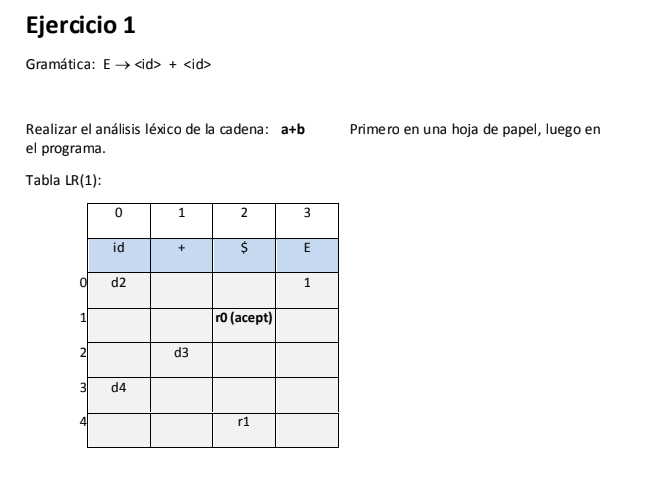
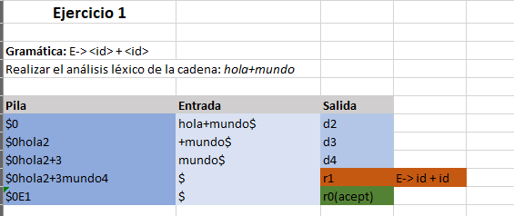
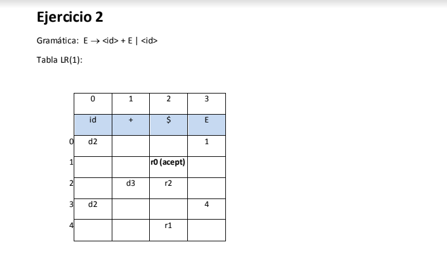
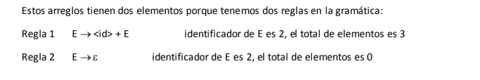
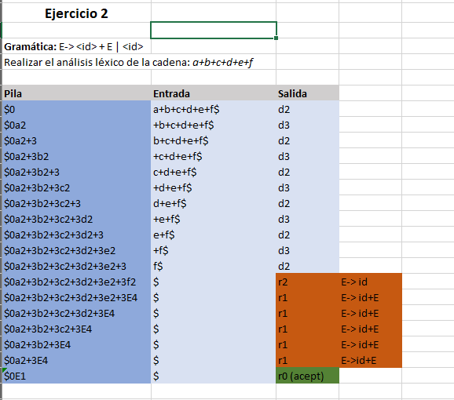

# Mini analizador sintáctico

En esta práctica se realiza un análisis sintáctico de dos gramáticas con sus respectivas matrices de transición. El análisis se realiza en Excel a través de tablas que representan la pila, la entrada y la salida.

## Gramática 1

Aquí se muestra la primera gramática junto con su matriz de transición, la cual es: **E-> < id > + < id >**

Realizamos el análisis sintáctico de la cadena **_hola + mundo_**, este fue el resultado:

## Gramática 2

Aquí se muestra la segunda gramática junto con su matriz de transición, la cual es: **E-> < id > + E | < id >**

Tambien cuenta con algunas reglas de reducción, las cuales son:

El analisis sintáctico de la cadena **_a+b+c+d+e+f_** muestra lo siguiente:

---

Con esta práctica se puede observar que el análisis sintáctico es una parte fundamental de la compilación de un programa, sobre todo al momento de validar cadenas de tokens para confirmar que la sintaxis es correcta.