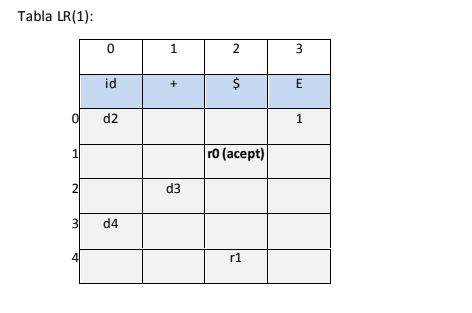
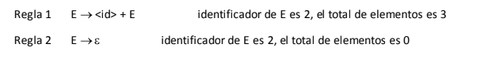
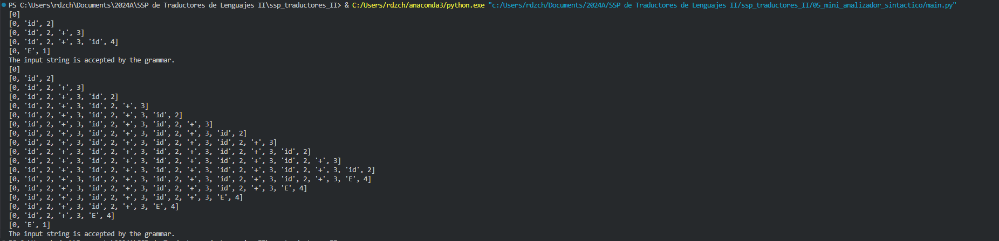
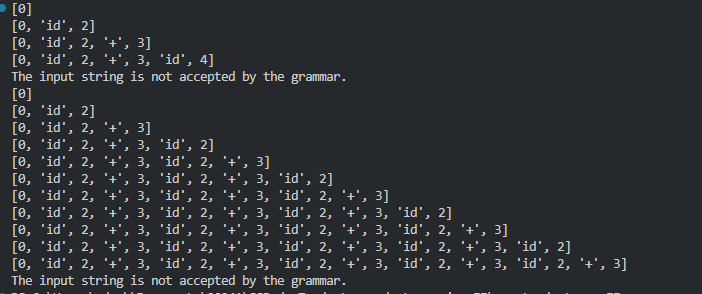

# Mini Analizador Sintáctico Implementado en código

El objetivo de esta práctica es implementar un analizador sintáctico para dos gramáticas diferentes, las cuales son:

1. E -> < id > + < id >
2.  E -> < id > + E | < id >

Las matrices de transición para cada una de las gramáticas son las siguientes:

**Gramática 1**


**Gramática 2**


Contando además esta gramática con las siugientes reglas de producción:


Para la implementación de este analizador sintáctico se utilizó Python, definimos las matrices de transición para cada gramática como una serie de diccionarios:


```python
# Definimos la gramática del ejemplo 1
action_table1 = {
    (0, 'id'): ('s', 2),
    (1, '$'): ('acc', ''),
    (2, '+'): ('s', 3),
    (3, 'id'): ('s', 4),
    (4, '$'): ('r', 'E -> id + id')
}
goto_table1 = {
            (0, 'E'): 1
}
grammar_rules1 = {
    'E -> id + id': ('E', 3)  # E -> id + id reduce 3 elementos de la pila
}

# Definimos la gramática del ejemplo 2
action_table2 = {
    (0, 'id'): ('s', 2),
    (1, '$'): ('acc', ''),
    (2, '+'): ('s', 3),
    (2, '$'): ('r', 'E -> id'),
    (3, 'id'): ('s', 2),
    (4, '$'): ('r', 'E -> id + E')
}
goto_table2 = {
    (0, 'E'): 1,
    (3, 'E'): 4
}
grammar_rules2 = {
    'E -> id': ('E', 1),       # E -> id reduce 1 elemento de la pila
    'E -> id + E': ('E', 3)    # E -> id + E reduce 3 elementos de la pila
}
```

Al implementar estos 3 diccionarios son pasados a un objeto de la clase `SyntacticAnalyzer` como atributos en el constructor, esto nos permite tener un analizador sintáctico que puede ser utilizado para cualquier gramática que se desee.

```python
class SyntacticAnalyzer:
    def __init__(self, action, goto, grammar):
        #Definimos la matriz de transición de la gramática 
        self.action = action
        self.goto = goto
        self.grammar = grammar
```

Una vez definidas las matrices de transición, se procede a implementar el método `parse` el cual recibe una lista de tokens y verifica si la secuencia de tokens es válida para la gramática definida. Esta función es muy  extensa y se puede revisar en el código fuente, por lo que sólo me limitaré a decir que su funcionamiento se basa en la implementación de un autómata de pila, el cual acepta una cadena si la pila llega a un estado de aceptación (en ambas gramáticas el estado de aceptación es el estado 1) al recibir el token `$`(terminal de la cadena).

También es importante mencionar la función `tokenize` la cual se encarga de convertir una cadena de texto en una lista de tokens, en este caso para las pruebas que realizamos, realmente simplificamos demasiado este proceso comparado con lo que se haría en un analizador lexico real.

## Ejeccución de las pruebas

Podemos ver que al realizar el analisis sintáctico de los ejemplos mencionados en actividades anteriores, el analizador sintáctico es capaz de reconocer las cadenas de tokens como validas, mostrando el siguiente comportamiento de las pilas:

```python
# Analizamos la primera gramática
analyzer = SyntacticAnalyzer(action_table1, goto_table1, grammar_rules1)
tokens = tokenize('hola+mundo')
result = analyzer.parse(tokens)

# Analizamos la segunda gramática
analyzer = SyntacticAnalyzer(action_table2, goto_table2, grammar_rules2)
tokens = tokenize('a+b+c+d+e+f')
result = analyzer.parse(tokens)
```



Y bueno si analizamos una cadena que no es válida para la gramática, el analizador sintáctico igualmente lo indicará:

```python
# Analizamos la primera gramática
analyzer = SyntacticAnalyzer(action_table1, goto_table1, grammar_rules1)
tokens = tokenize('hola+mundo+cruel')
result = analyzer.parse(tokens)

# Analizamos la segunda gramática
analyzer = SyntacticAnalyzer(action_table2, goto_table2, grammar_rules2)
tokens = tokenize('a+b+c+d+e+')
result = analyzer.parse(tokens)
```


Como podemos ver, la pila llega a un estado de error, es decir, no hay una transición definida para el estado actual y el token que se está recibiendo, por lo que el analizador sintáctico indica que la cadena no es válida para la gramática.