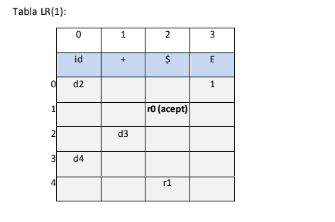
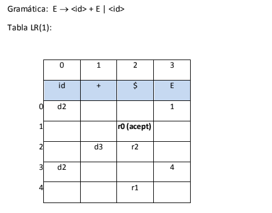
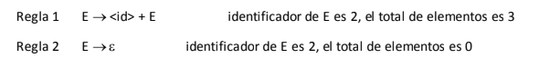
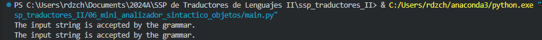
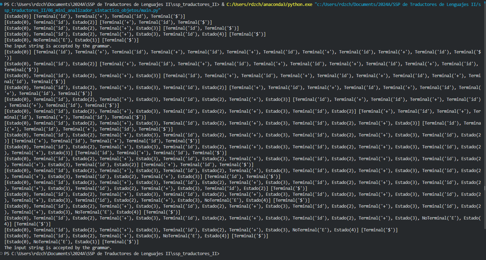
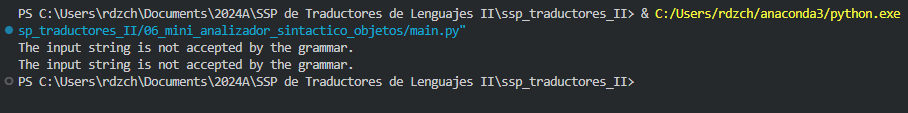

# Mini Analizador Sintáctico Implementado con Objetos

En esta ocasión es retomaremos el analizador sintáctico que implementamos en la actividad anterior, pero ahora lo haremos de utiilizando programación orientada a objetos.

Recordemos que las gramáticas que utilizamos en la actividad anterior son las siguientes:

1. E -> < id > + < id >
2. E -> < id > + E | < id >

Las matrices de transición para cada una de las gramáticas siguen siendo las mismas:

**Gramática 1**



**Gramática 2**





De igual manera las matrices se implementan como diccionarios de python:


```python
# Definimos la gramática del ejemplo 1
action_table1 = {
    (0, 'id'): ('s', 2),
    (1, '$'): ('acc', ''),
    (2, '+'): ('s', 3),
    (3, 'id'): ('s', 4),
    (4, '$'): ('r', 'E -> id + id')
}
goto_table1 = {
            (0, 'E'): 1
}
grammar_rules1 = {
    'E -> id + id': ('E', 3)  # E -> id + id reduce 3 elementos de la pila
}

# Definimos la gramática del ejemplo 2
action_table2 = {
    (0, 'id'): ('s', 2),
    (1, '$'): ('acc', ''),
    (2, '+'): ('s', 3),
    (2, '$'): ('r', 'E -> id'),
    (3, 'id'): ('s', 2),
    (4, '$'): ('r', 'E -> id + E')
}
goto_table2 = {
    (0, 'E'): 1,
    (3, 'E'): 4
}
grammar_rules2 = {
    'E -> id': ('E', 1),       # E -> id reduce 1 elemento de la pila
    'E -> id + E': ('E', 3)    # E -> id + E reduce 3 elementos de la pila
}
```

La principal diferencia con la implementación anterior es que ahora se implementan tres clases: Terminal, NoTerminal y Estado, las cuales heredan de la clase ElementoPila. También se implementa una clase llamada Pila, cuyo comportamiento nos va a permitir implementar el parser de manera más sencilla, ya que cuenta con los métodos `push`, `pop` y `top` que nos permiten manipular la pila.  

```python
class ElementoPila:
    pass

class Terminal(ElementoPila):
    def __init__(self, symbol):
        self.symbol = symbol

    def __repr__(self):
        return f"Terminal('{self.symbol}')"

class NoTerminal(ElementoPila):
    def __init__(self, symbol):
        self.symbol = symbol

    def __repr__(self):
        return f"NoTerminal('{self.symbol}')"

class Estado(ElementoPila):
    def __init__(self, state):
        self.state = state

    def __repr__(self):
        return f"Estado({self.state})"

class Pila:
    def __init__(self):
        self.items = []

    def push(self, item):
        if isinstance(item, ElementoPila):
            self.items.append(item)
        else:
            raise TypeError("Only objects of type ElementoPila can be pushed onto the stack.")

    def pop(self):
        if self.items:
            return self.items.pop()

    def top(self):
        if self.items:
            return self.items[-1]

    def __repr__(self):
        return str(self.items)
```

Como podemos ver, la clase `SyntaticAnalyzer` no cambia mucho con respecto a la implementación anterior, pero agrega un atributo `stack` que es una instancia de la clase `Pila`, ademas de que realiza un `push` del estado 0 a la pila al momento de inicializar el objeto. 

Otra observación que podríamos hacer es la reducción de la cantidad de código que se tiene que escribir en el parser, ya que ahora se pueden utilizar los métodos `push`, `pop` y `top` de la clase `Pila` para manipular la pila, en lugar de tener que hacerlo manualmente como se hacía en la implementación anterior.

```python
class SyntacticAnalyzerOO:
    def __init__(self, action_table, goto_table, grammar_rules):
        self.action = action_table
        self.goto = goto_table
        self.grammar = grammar_rules
        self.stack = Pila()
        self.stack.push(Estado(0))

    def parse(self, tokens):
        cursor = 0

        while True:
            print(self.stack, tokens[cursor:])
            top_state = self.stack.top()
            symbol = tokens[cursor] if cursor < len(tokens) else Terminal('$')
            action_entry = (top_state.state, symbol.symbol)

            if action_entry in self.action:
                action, value = self.action[action_entry]

                if action == 's':  # Shift action
                    self.stack.push(symbol)  # Shift symbol
                    self.stack.push(Estado(value))  # Shift state
                    cursor += 1

                elif action == 'r':  # Reduce action
                    for _ in range(self.grammar[value][1] * 2):
                        self.stack.pop()  # Pop state and symbol
                    non_terminal = NoTerminal(self.grammar[value][0])
                    self.stack.push(non_terminal)
                    goto_state = self.stack.items[-2].state
                    goto_entry = (goto_state, non_terminal.symbol)
                    self.stack.push(Estado(self.goto[goto_entry]))

                elif action == 'acc':  # Accept action
                    print("The input string is accepted by the grammar.")
                    return True

            else:
                print("The input string is not accepted by the grammar.")
                return False

        return False
```

## Ejeccución de las pruebas

Podemos ver que el analizador sintáctico funciona de manera correcta para las dos gramáticas que estamos utilizando:

```python
analyzer_grammar_1 = SyntacticAnalyzerOO(action_table_grammar_1, goto_table_grammar_1, grammar_rules_grammar_1)
analyzer_grammar_2 = SyntacticAnalyzerOO(action_table_grammar_2, goto_table_grammar_2, grammar_rules_grammar_2)

tokens_1 = tokenize('hola+mundo')
tokens_2 = tokenize('a+b+c+d+e+f')

analyzer_grammar_1.parse(tokens_1)
analyzer_grammar_2.parse(tokens_2)
```


Aunque es verdad que si queremos imprimir toda la pila en cada iteración del parser, la salida se vería un poco más desordenada, pero esto es solo un detalle de presentación que se puede corregir fácilmente. 



Ahora bien, si pasamos una cadena que no es aceptada por la gramática, el analizador sintáctico nos lo indicará como es de esperarse:

```python
analyzer_grammar_1 = SyntacticAnalyzerOO(action_table_grammar_1, goto_table_grammar_1, grammar_rules_grammar_1)
analyzer_grammar_2 = SyntacticAnalyzerOO(action_table_grammar_2, goto_table_grammar_2, grammar_rules_grammar_2)

tokens_1 = tokenize('hola+mundo+cruel')
tokens_2 = tokenize('a+b+c+d+e++')

analyzer_grammar_1.parse(tokens_1)
analyzer_grammar_2.parse(tokens_2)
```


Con esta implementacion, podemos concluir que utilizar programación orientada a objetos para implementar el analizador sintáctico nos permite tener un código más limpio y organizado, además de que nos permite reutilizar el código de manera más sencilla.