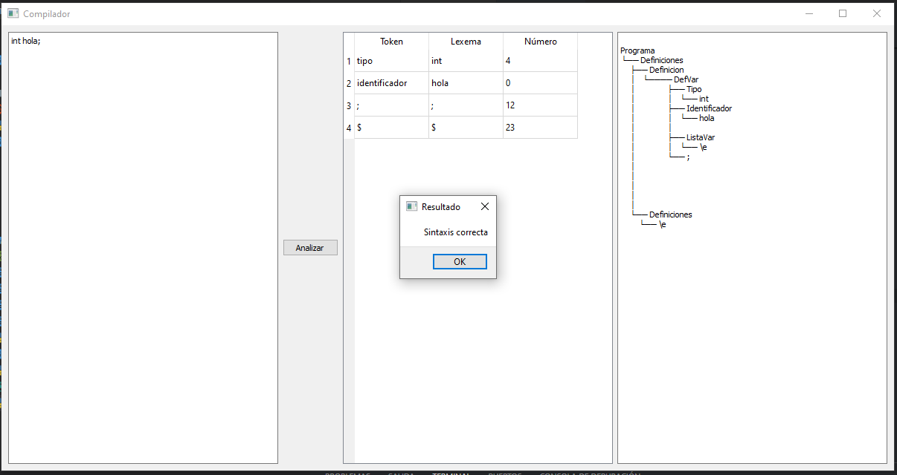
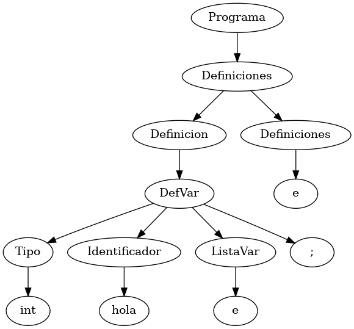

# Analizador Sintáctico 

Este programa consiste de las fases del análisis léxico y sintáctico de un compilador integrados en una interfaz de PyQt5. Permite a los usuarios introducir cadenas de texto, las cuales son analizadas para identificar tokens y estructuras sintácticas según nuestras reglas definidas para determinar si la cadena es válida o inválida dentro del lenguaje y mostrar el árbol de análisis correspondiente.

## Estructura del Proyecto

El esta modularizado en los siguientes archivos:
- **scanner.py**: Contiene la implementación del analizador léxico y devuelve una lista de tokens.
- **parser.py**: Contiene la implementación del analizador sintáctico.
- **UI.py**: Contiene la implementación de la interfaz gráfica.

## Funcionamiento

El analizador realiza los siguientes pasos:

1. **Análisis Léxico**: Identifica tokens en la entrada del usuario basándose en caracteres específicos y transiciones de estado definidas por un autómata finito. Retorna una lista de objetos `Token` con la información de cada token identificado, en este caso los datos son Lexema, Símbolo y Número.
2. **Análisis Sintáctico**: Utiliza una tabla LR y reglas sintácticas definidas para verificar la validez sintáctica de la cadena de entrada a través de un autómata de pila. Dentro del módulo utilizamos la librería pandas para manejar la tabla LR en formato CSV. Esto nos permite cargar la tabla directamente y no tener que transcribirla manualmente o manejarla en un formato más complicado. El algoritmo de análisis estpa optimizado para funcionar con Pnadas y su manejo de columnas y filas. Si la cadena es válida, se regresan los nodos del árbol de análisis  y un booleano indicando que la cadena es válida. En caso contrario, se regresa un booleano indicando que la cadena es inválida.
3. **Interfaz Gráfica**: La interfaz gráfica permite a los usuarios introducir una cadena de texto y analizarla. Muestra los tokens identificados y el resultado del análisis sintáctico dentro de un entorno amigable para el usuario, simulando algo similar a un IDE.

## Pruebas

En la actividad se sugiere introducir la cadena de prueba 'int hola;' para verificar el funcionamiento del analizador. La cadena es válida y el árbol de análisis se muestra correctamente como podemos ver en la siguiente imagen:

#### Representación del Árbol de Análisis con un grafo:

e = lambda
